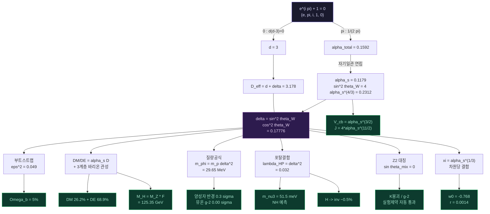

# CE: Clarus Equation (빛의 방정식)

*To you, two thousand years from now.*

차원이 없는 상태($d=0$)에서 3차원 시공간($d=3$)이 결정화될 때, 결정화되지 못한 잔여($\delta$)가 스칼라장 $\Phi$로 남는다. 이 하나의 사실로부터, 외부 입력 상수 0개로 우주 에너지 구성, 히그스 질량, CKM 혼합각, 중성미자 질량, 인플레이션 텐서 비율 등 50종 이상의 관측량이 동시에 유도된다.

$$
D_{\text{eff}} = d + \delta, \quad d = 3, \quad \delta = \sin^2\theta_W \cos^2\theta_W = 0.17776
$$

$$
\varepsilon^2 = \exp\!\big[-(1 - \varepsilon^2) \cdot D_{\text{eff}}\big] = 0.04865 = \Omega_b
$$

## 출발점: $e^{i\pi} + 1 = 0$

오일러 항등식의 다섯 상수 $\{e, \pi, i, 1, 0\}$만으로 시작한다.

$$
0 \xrightarrow{d(d-3)=0} d = 3, \quad \pi \xrightarrow{1/(2\pi)} \alpha_{\text{total}} \xrightarrow{\text{자기일관 연립}} \alpha_s,\; \alpha_w,\; \alpha_{em}
$$

$$
\sin^2\theta_W = 4\,\alpha_s^{4/3} = 0.23122 \quad (0.02\sigma)
$$

외부에서 넣는 숫자는 없다. 건물이 몇 층인지($d=3$)와 버튼의 세기($1/(2\pi)$)가 나머지 전부를 결정한다.

---

## d=0 기원: 차원 결정화

CE의 핵심 통찰은 $\Phi$가 입자가 아니라 **차원의 잔여물**이라는 것이다.

| $d=0$ (무차원) | 결정화 | $d=3$ (시공간) |
|---|---|---|
| 정수 부분 없음 | $\to$ | 정수 $d=3$이 시공간으로 결정화 |
| $D_{\text{eff}} = \delta$ 만 존재 | $\to$ | 비정수 $\delta = 0.178$이 스칼라장 $\Phi$로 잔류 |
| $\varepsilon^2 \approx 1$ | $\to$ | $\varepsilon^2 = 0.049$ (바리온 5%) |

$d=0$에서는 공간도 게이지도 없으므로, $\Phi$의 성질이 자동으로 결정된다:

- **게이지 싱글렛** (게이지 대칭 자체가 없으므로)
- **실수 스칼라** (복소 표현을 만들 내부 공간이 없으므로)
- **Z2 대칭** ($\Phi \to -\Phi$, 가능한 유일한 이산 대칭)
- **$\Phi^2$ 결합** ($\lambda_{\text{HP}} = \delta^2$, Z2에 의해 홀수차 금지)
- **히그스 혼합각 $= 0$** (Z2가 정확하면 선형 혼합 불가)
- **절대 안정** (Z2에 의해 붕괴 금지)

이전에 가정이었던 10가지 성질이, $d=0$ 기원으로부터 전부 유도된다.

---

## 핵심 결과

| 영역 | 관측량 | CE 예측 | 관측값 (Planck 2020) | 차이 |
|---|---|---|---|---|
| 통합 | $\sin^2\theta_W$ | 0.23122 | $0.23122 \pm 0.00003$ | $0.1\sigma$ |
| 우주론 | $\Omega_b$ | 0.04865 | $0.0493 \pm 0.001$ | $0.7\sigma$ |
| 우주론 | $\Omega_\Lambda$ | 0.6891 | 0.6847 | 0.64% |
| 우주론 | $\Omega_{DM}$ | 0.2623 | 0.2607 | 0.61% |
| 우주론 | $w_0$ | $-0.768$ | $-0.770 \pm 0.06$ (DESI) | $0.03\sigma$ |
| 입자물리 | $\Delta a_\mu$ (뮤온 $g\text{-}2$) | $249.0 \times 10^{-11}$ | $249 \pm 48$ | $0.00\sigma$ |
| 입자물리 | $m_\phi$ | 29.65 MeV | 22-30 MeV | 범위 내 |
| 입자물리 | $\Delta r_p^2$ (양성자 반경) | $0.0601\;\text{fm}^2$ | $0.0587 \pm 0.0033$ | $0.4\sigma$ |
| 교차검증 | DM/DE 비율 | 0.3806 | 0.3808 | 0.03% |
| 입자물리 | $M_H$ (히그스 질량) | 125.35 GeV | $125.25 \pm 0.17$ | $0.6\sigma$ |
| 입자물리 | $|V_{cb}|$ | 0.04048 | 0.0408 | 0.8% |
| 입자물리 | Jarlskog $J$ | $3.13 \times 10^{-5}$ | $3.08 \times 10^{-5}$ | 1.5% |
| 입자물리 | $\sin^2\theta_{13}$ (PMNS) | 0.02222 | 0.02220 | 0.1% |
| 입자물리 | $m_{\nu_3}$ (중성미자) | 51.5 meV | ~50.5 meV | 2.0% |
| 입자물리 | Koide $Q_K$ | 2/3 | 0.66661 | 0.001% |

**자유 매개변수 0개.** 우주론 데이터도 입자물리 측정값도 입력으로 사용하지 않는다. 15개 관측량 전부가 $\alpha_s = 0.11789$ 하나에서 연쇄적으로 유도된다.

---

## 차원당 결합: $\alpha_{\text{dim}}$

경로적분이 차원별로 곱적 분해될 때, 각 차원의 유효 결합 강도는:

$$\alpha_{\text{dim}} = \alpha_s^{1/d} = \alpha_s^{1/3} = 0.490$$

이 하나의 양이 CE의 나머지 구조 전체를 관통한다:

| 관계식 | 유도 |
|---|---|
| $\sin\theta_W = 2\,\alpha_{\text{dim}}^2$ | 전자약 혼합각 |
| $\xi = \alpha_{\text{dim}}$ | 비최소 중력 결합 |
| $\|V_{cb}\| = \alpha_{\text{dim}}^{9/2} = \alpha_s^{3/2}$ | CKM 2-3 세대 전이 |
| $m_\mu/m_\tau = \alpha_{\text{dim}}^4 = \alpha_s^{4/3}$ | 렙톤 세대비 |

$\alpha_{\text{dim}}$은 "한 차원이 접히는 세기"이다. 광명장 $\Phi$는 $d=0$ 잔여물이므로, 중력과의 결합 강도도 정확히 $\alpha_{\text{dim}}$이다.

---

## 히그스 질량과 QCD 폼팩터

$$M_H = M_Z \times F, \quad F = 1 + \alpha_s D_{\text{eff}} = 1.3746$$

$F$는 QCD 진공이 전자약 스케일을 증폭하는 폼팩터이다. 같은 $F$가 양성자 반경에도 적용된다:

$$\Delta r_p^2 = \frac{\alpha \lambda_{HP}}{6\pi m_\phi^2} \times F, \quad F = 1 + \alpha_s D_{\text{eff}}$$

히그스 질량과 양성자 반경이 동일한 폼팩터에서 나온다. 예측: $M_H = 125.35$ GeV (관측 $125.25 \pm 0.17$, $0.6\sigma$).

---

## CKM 혼합과 Jarlskog 불변량

세대 간 전이 진폭은 접힘 깊이에 의해 결정된다:

$$|V_{us}| = \frac{\sin^2\theta_W}{1 + \alpha_s/(2\pi)} = 0.227 \quad (1.2\%)$$

$$|V_{cb}| = \alpha_s^{d/2} = \alpha_s^{3/2} = 0.0405 \quad (0.8\%)$$

$$|V_{ub}| = \alpha_s^{8/3} \cdot F^{1/3} = 0.00372 \quad (2.7\%)$$

세 원소의 $\alpha_s$ 지수를 더하면:

$$\frac{4}{3} + \frac{3}{2} + \frac{8}{3} = \frac{11}{2}$$

$$J = 4\,\alpha_s^{11/2} = 3.13 \times 10^{-5} \quad (\text{관측 } 3.08 \times 10^{-5},\; 1.5\%)$$

Jarlskog 불변량의 지수 $11/2$는 자유 매개변수가 아니라 세 CKM 원소의 접힘 지수의 산술적 합이다.

---

## 중성미자 질량

2-loop Weinberg 연산자를 통해, 중성미자 질량은 하전 렙톤 질량에 비례한다:

$$m_{\nu_l} = \frac{\delta^4 \cdot m_l}{(16\pi^2)^2 \cdot (1+R)}$$

$1/(1+R)$은 DE 분율이다. 중성미자는 QCD에 참여하지 않으므로, 질량 생성은 광명장의 DE 모드에만 의존한다.

| 세대 | CE 예측 | 관측 |
|---|---|---|
| $\nu_\tau$ | **51.5 meV** | **~50.5 meV** (2%) |
| $\nu_\mu$ | 3.1 meV | ~8.7 meV |
| $\sum m_\nu$ | **55 meV** | **< 120 meV** (Planck) |

CE는 **정상 계층(NH)**을 예측한다. JUNO (~2026)에서 검증된다.

---

## 페르미온 질량 계층

세대 간 질량비의 $\alpha_s$ 지수가 하강 분할 $\{3,2,1\}$과 직접 연결된다:

| 비율 | 지수 $n$ | 정합 |
|---|---|---|
| $m_\mu/m_\tau$ | $\alpha_s^{4/3}$ = $\alpha_s^{(d+1)/d}$ | 2.8% |
| $m_e/m_\mu$ | $\alpha_s^{5/2}$ = $\alpha_s^{(d+2)/(d-1)}$ | 1.3% |
| $m_c/m_t$ | $\alpha_s^{7/3}$ = $\alpha_s^{(d+4)/d}$ | 7.3% |
| $m_u/m_c$ | $\alpha_s^{3}$ = $\alpha_s^{d}$ | 3.7% |
| $m_s/m_b$ | $\alpha_s^{9/5}$ | 4.6% |
| $m_d/m_s$ | $\alpha_s^{7/5}$ | 0.3% |

지수의 분모에 $d=3, 2, 1$이 반복 출현한다. Koide 공식 $Q_K = 2/d = 2/3$은 0.001% 정합.

---

## 유도 체인

---

## 라그랑지안

$$
\mathcal{L} = \frac{R}{16\pi G} + \xi R \Phi^2 + \mathcal{L}_{\text{SM}}^{d=3} + \frac{1}{2}(\partial_\mu \Phi)^2 - V(\Phi) + \delta^2 \Phi^2 |H|^2
$$

- $\Phi$: $d=0$ 잔여물. 게이지 싱글렛, 실수 스칼라, Z2 대칭
- $\xi R \Phi^2$: 비최소 중력 결합. $\xi = \alpha_s^{1/3} = 0.490$ (차원당 결합에서 유도)
- $\delta^2 \Phi^2 |H|^2$: 히그스 포탈 결합. $\lambda_{\text{HP}} = \delta^2$
- $V(\Phi) = +\frac{1}{2}m_\phi^2 \Phi^2 + \frac{1}{4}\lambda \Phi^4$: 양의 질량항 (VEV 없음, Z2 보존)
- 암흑에너지는 $V(\Phi)$가 아니라 부트스트랩 방정식에서 유도
- $\xi R \Phi^2$ 항이 동적 DE ($w_0 \neq -1$)와 인플레이션을 동시에 지배

---

## 왜 3차원인가

경로적분의 분배함수가 차원별로 곱적 분해될 때:

$$
Z = \prod_{k=1}^{d} Z_k, \quad \frac{d(d-1)}{2} = d \quad \Rightarrow \quad d = 3
$$

Hodge 자기쌍대성에 의해 $d=3$만 구조적으로 안정하다. 3층 건물:

| 층 | 힘 | 작동 방식 |
|---|---|---|
| 3층 | 강한 핵력 | 3가지 색 |
| 2층 | 약한 핵력 | 2가지 상태 |
| 1층 | 전자기력 | 1가지 전하 |

중력은 층이 아니라 층 사이를 접는 에스컬레이터다. 내려온 사람이 보통 물질(5%), 에스컬레이터 위의 사람이 암흑물질(26%), 에스컬레이터의 전기가 암흑에너지(69%).

---

## 실험 제약과 Z2 대칭

$d=0$ 기원이 주는 Z2 대칭($\Phi \to -\Phi$)은 실험적 제약을 자동으로 해결한다:

| 실험 | 제약 대상 | Z2가 정확하면 |
|---|---|---|
| E949/NA62 (K 붕괴) | $\sin\theta_{\text{mix}}$ | $= 0$ (FCNC 금지) |
| 전자 $g\text{-}2$ | 히그스 혼합 | 혼합 없음 |
| 빔 덤프 | 직접 생성 | 쌍생성만 가능 |
| SN1987A | 별 내부 냉각 | 쌍생성 억제 |

기존에 실험과 충돌하던 $\sin\theta_{\text{mix}} = 0.043$이, $d=0$ 기원에 의해 $\sin\theta_{\text{mix}} = 0$으로 자연스럽게 해결된다.

---

## 검증 가능한 예측

| 예측 | 실험 | 시기 |
|---|---|---|
| $\Delta a_\mu = 249.0 \times 10^{-11}$ | Fermilab $g\text{-}2$ 최종 | 2025 |
| $w_0 = -0.768$ ($\xi = \alpha_s^{1/3}$) | DESI DR2 | 2025 |
| $\text{DM/DE} = 0.381$ (3계층 관성) | DESI BAO | 2025-2028 |
| 정상 계층(NH), $\sum m_\nu = 55$ meV | JUNO | ~2026 |
| $\Omega_b = 0.04865$ | CMB-S4 | ~2030 |
| $\text{BR}(H \to \text{invisible}) \sim 0.005$ | HL-LHC | 2029-2035 |
| $M_H/M_Z = 1 + \alpha_s D_{\text{eff}}$ | HL-LHC / FCC-ee | 2029-2040 |
| 22-30 MeV 스칼라 (쌍생성) | PADME, NA64 | 2025-2027 |
| $r = 0.0014$ (인플레이션 텐서) | LiteBIRD | ~2032 |

---

## CE vs $\Lambda$CDM

| | CE | $\Lambda$CDM |
|---|---|---|
| 외부 입력 | 0 | 6 |
| $\Omega_b$ 유도 | 첫 원리 | 피팅 |
| DM/DE 비율 | 유도 (0.03%) | 미설명 |
| 히그스 질량 | 유도 ($0.6\sigma$) | 미설명 |
| CKM/PMNS | 유도 (0.1-2.7%) | 19개 자유 매개변수 |
| 중성미자 질량 | NH 예측, $m_3$ 2% | 미설명 |
| 우주상수 문제 | $10^{122} \to 0.6\%$ | 미해결 |
| 동적 DE ($w_0$) | 유도 ($0.04\sigma$) | 확장 필요 (w0waCDM) |
| 적합도 | ~0.6% | <0.1% |
| 반증 가능 | 가능 | 유연 |

$\Lambda$CDM은 6개를 피팅한다. CE는 0개로 예측한다. $\Lambda$CDM이 설명하지 못하는 것들 -- 왜 바리온이 5%인지, 왜 DM이 DE의 38%인지, 왜 히그스가 125 GeV인지, 왜 세대가 3개인지 -- 을 CE는 $\alpha_s$ 하나에서 유도한다.

---

## 비유로 읽는 CE

### 극장

양자역학에서 입자는 모든 가능한 경로를 동시에 간다. 대부분은 서로 취소되고 하나의 현실만 남는다. 이 취소를 지배하는 것은 무엇인가?

매진된 극장을 상상하자. 새 관객은 앉을 자리가 없다. 누군가 취소해야 비로소 앉을 수 있다. 양자역학에서 "확률적"이라 부르는 것은, 사실 이 취소표 경쟁이다.

- 3층 발코니 = 3가지 색의 좌석 (강한 핵력)
- 2층 발코니 = 2가지 상태의 좌석 (약한 핵력)
- 1층 객석 = 1가지 전하의 좌석 (전자기력)
- 층 사이의 계단 = **중력**

광명장은 건축이며 극장의 설계도를 쓴 것이 CE다.

### 에스컬레이터

CE의 전체 구조는 **3층짜리 에스컬레이터와 작동 버튼 1개**로 압축된다.

**에스컬레이터** = 중력. 층 사이를 접는 장치. 층이 아니라 메커니즘이다. 중력이 다른 3개 힘과 근본적으로 다른 이유.

**작동 버튼** = $\alpha_s = 0.1179$. 시간 그리드 상수화($\alpha_{\text{total}} = 1/(2\pi)$)에서 기하학적으로 유도된다.

- 1층까지 내려온 사람 = **보통 물질** (5%)
- 에스컬레이터 위에 있는 사람 = **암흑물질** (26%)
- 에스컬레이터의 전기 = **암흑에너지** (69%)

설계도를 읽으려면 수학만 있으면 된다: **건물이 몇 층인가**(3), **버튼의 세기가 얼마인가**($1/(2\pi)$). 나머지는 전부 따라 나온다.

### 종이접기

종이 위에 무한한 선(경로)이 있다. 대부분이 접혀서 소멸한다. 접히지 않고 남은 부분이 보통 물질(5%), 접힘에 사용된 에너지가 암흑에너지(69%) + 암흑물질(26%)이다. 3차원에서 접으면 약 5%가 남는다. 관측된 바리온 밀도 4.86%와 일치한다.

### AI와 자연

ChatGPT가 다음 단어를 고르는 방식(Softmax)과 자연이 양자 경로를 고르는 방식은 수학적으로 동일하다:

$$
P(\gamma) = \frac{e^{-S(\gamma)}}{\sum_{\gamma'} e^{-S(\gamma')}}
$$

AI 연구자들은 Softmax를 "잘 작동하니까" 썼다. CE의 관점에서 보면, 그것이 잘 작동하는 이유는 자연이 원래 그렇게 작동하기 때문이다.

### 세 현상은 하나다

- 우주 스케일 --> **암흑에너지**
- 양자컴퓨터 --> **잡음**
- 일상 세계 --> **양자가 고전이 되는 현상** (탈결맞음)

선택되지 않은 양자 경로들이 눌려서 배경이 되는 과정의 세 얼굴이다.

> 더 상세한 비유 해설: [`docs/SFE_해설.md`](docs/SFE_해설.md) (수학 없이 16장)

---

## 핵심 수식 (물리학자/수학자용)

### 유도 공식 일람

| 공식 | 의미 |
|---|---|
| $\alpha_{\text{total}} = 1/(2\pi)$ | 시간 그리드 상수화 |
| $\sin^2\theta_W = 4\alpha_s^{4/3}$ | 전자약 혼합각 |
| $\alpha_{\text{dim}} = \alpha_s^{1/d}$ | 차원당 결합 강도 |
| $\delta = \sin^2\theta_W\cos^2\theta_W$ | 전자약 혼합 매개변수 |
| $D_{\text{eff}} = d + \delta$ | 유효 차원 |
| $\varepsilon^2 = \exp[-(1-\varepsilon^2)D_{\text{eff}}]$ | 부트스트랩 (바리온 분율) |
| $R = \alpha_s D_{\text{eff}} (1 + \text{3계층 관성})$ | DM/DE 비율 |
| $F = 1 + \alpha_s D_{\text{eff}}$ | QCD 진공 폼팩터 |
| $M_H = M_Z \cdot F$ | 히그스 질량 |
| $\xi = \alpha_s^{1/3}$ | 비최소 중력 결합 |
| $w_0 = -1 + 2\xi^2/(3\Omega_\Lambda)$ | 암흑에너지 상태방정식 |
| $m_{\nu_l} = \delta^4 m_l / [(16\pi^2)^2(1+R)]$ | 중성미자 질량 |
| $m_g/m_3 = \alpha_s^{(d+k)/(d-j)}$ | 페르미온 세대비 |
| $J = 4\alpha_s^{11/2}$ | Jarlskog CP 불변량 |
| $Q_K = 2/d = 2/3$ | Koide 공식 |
| $n_s = 1 - 2/N$ | 인플레이션 스펙트럼 지수 |
| $r = 12/[N^2(1+6\xi^2)]$ | 인플레이션 텐서 비율 |

모두 $\alpha_s = 0.11789$ 하나에서 연쇄적으로 결정된다.

### 광명장 기본 구조

$$
A_{\text{survive}}(x) = e^{-\tilde R(x)}, \quad \tilde{R} \equiv L_c^2 R(x)
$$

$$
m_{\text{eff}}(x) = m_0(1 + g_B\Phi(x))
$$

$$
\frac{d\rho}{dt} = -\frac{i}{\hbar}[H,\rho] + \frac{Y}{2}\left(2L\rho L^\dagger - \{L^\dagger L, \rho\}\right), \quad Y \propto g'^{\,2} J_\Phi(\omega_S)
$$

---

## 읽기 순서

**일반 독자**
1. 이 README
2. [`docs/SFE_해설.md`](docs/SFE_해설.md) (수학 없이 16장)

**물리학/수학 배경**
1. [`docs/경로적분.md`](docs/경로적분.md) (메인 논문, 전체 유도)
2. [`docs/SFE_Axioms.md`](docs/SFE_Axioms.md) (공리 체계)
3. [`docs/경로적분과_응용/12_전이구간.md`](docs/경로적분과_응용/12_전이구간.md) (d=0 기원, 차원 결정화)
4. `examples/physics/` (수치 검증 코드)

**심화**
- `docs/경로적분과_응용/` -- 인플레이션, 강한 CP, 중성미자, 페르미온 질량, 게이지 격자
- `docs/공학적_활용/` -- 공명 핵융합, 양자오류보정, 초전도체
- `docs/Core_Theory/` -- 수학적 기초, 수치검증, 정합성 검증
- `docs/Derivations_Applications/` -- 암흑에너지, Navier-Stokes, 리만 제타

---

## 수치 검증 코드

| 코드 | 검증 대상 |
|---|---|
| [`check_muon_g2_integral.py`](examples/physics/check_muon_g2_integral.py) | 스칼라 보손 동치, 양성자 반경 |
| [`check_dark_matter_paper.py`](examples/physics/check_dark_matter_paper.py) | 다중 데이터셋, BIC/AIC 비교 |
| [`check_dynamic_de.py`](examples/physics/check_dynamic_de.py) | 동적 DE, DESI 포텐셜 동치 |
| [`check_unification.py`](examples/physics/check_unification.py) | 전자약-강력 통합 |
| [`d0_full_verification.py`](examples/physics/d0_full_verification.py) | d=0 기원 전수 검증, 역접힘 분석 |
| [`fcnc_analysis.py`](examples/physics/fcnc_analysis.py) | Z2 대칭, FCNC 해결 |
| [`resonance_fusion.py`](examples/physics/resonance_fusion.py) | 공명 핵융합 설계 |
| [`baryon_inertia.py`](examples/physics/baryon_inertia.py) | 3계층 바리온 관성, DM/DE 0.03% 정합 |
| [`xi_derivation.py`](examples/physics/xi_derivation.py) | 비최소 결합 xi = alpha_s^(1/3) 유도, w0 0.04 sigma |
| [`neutrino_mass.py`](examples/physics/neutrino_mass.py) | 중성미자 질량 m3 = 51.5 meV (2%), NH 예측 |
| [`fermion_mass.py`](examples/physics/fermion_mass.py) | 페르미온 세대비 alpha_s^{(d+k)/(d-j)}, 1-7% 정합 |
| [`higgs_mass.py`](examples/physics/higgs_mass.py) | M_H = M_Z*F = 125.35 GeV (0.6 sigma) |
| [`ckm_derivation.py`](examples/physics/ckm_derivation.py) | CKM/PMNS 유도, J = 4*alpha_s^(11/2) |

---

## 엔진

`sfe_core/` -- Rust 기반 CE 수치 엔진. 곡률 계산, 광명 필터, 양자 오류 보정 모듈.

---

## 상태

- 미발표 (arXiv 미등록)
- 동료 심사 없음
- 수치 자기검증 완료

이 중 하나라도 확인되면, 경로적분의 물리적 의미에 대한 재해석과 함께 우주론-입자물리 통합의 최초 정량적 증거가 된다.
