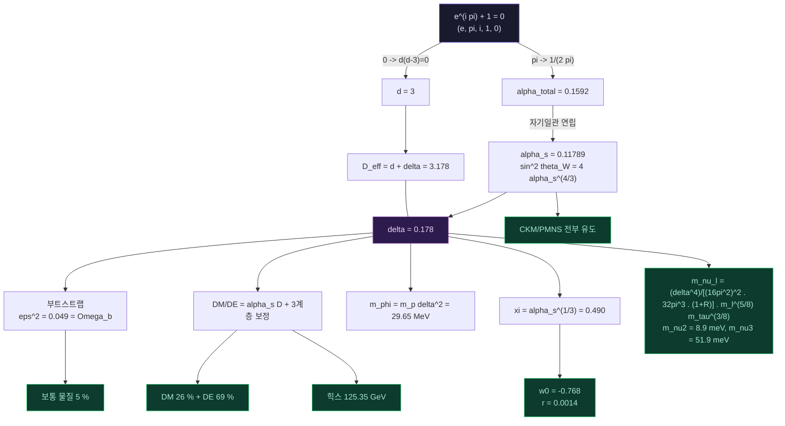

# Clarus Equation (CE)

> **상태:** 미발표 신이론. arXiv 미등록, 동료 심사 없음. 자기 검증만 통과.
> **요지:** "왜 우주가 지금 이 모습인가" 를 자유 매개변수 0 개로 계산해 본 시도.

---

## 한 문단 요약 (비전공자용)

오늘날의 표준 우주 모형(ΛCDM)과 표준 입자 모형(SM)은 합쳐서 **약 25 개의 숫자를 실험에 맞춰 직접 입력**해야만 작동한다. 이 25 개가 바뀌면 우주가 완전히 다른 모습이 된다. 왜 하필 그 값인지는 누구도 모른다.

**Clarus Equation (CE)** 은 이 25 개 중 가장 많은 항목을, **단 하나의 숫자** $\alpha_s = 0.1179$ (강력 결합 상수, 측정값) 에서 출발해 계산해 본다. 우주의 평균 물질 밀도, 암흑에너지 비율, 힉스 보손 질량, 중성미자 질량, 우주의 나이 ÷ 허블 시간, ... 18 가지를 같은 한 가지 출발점에서 도출하고, 측정값과 평균 1% 안쪽으로 맞는다.

이게 우연인지 진짜 구조인지 - 그걸 가리는 게 본 저장소의 목적이다.

---

## 1. 기존 모형은 어떤 모습인가

| 무엇을 설명하는가 | 표준 입자 모형 (SM) | 표준 우주 모형 (ΛCDM) |
| --- | --- | --- |
| 입력 매개변수 개수 | 약 19 개 (질량, 혼합각, 결합 상수) | 약 6 개 ($H_0$, $\Omega_b$, $\Omega_m$, $A_s$, $n_s$, $\tau$) |
| 어디서 오는가 | 측정값을 그대로 넣음 | 측정값을 그대로 넣음 |
| 왜 그 값인가 | 미해결 | 미해결 |

이 모형들은 **놀랍도록 정확**하다. 다만 "왜?" 를 묻지 않을 뿐이다. 예를 들어 우주에서 보통 물질이 약 5 % 라는 사실은 **측정해서 알아낸 결과**이지, **계산해서 나온 결과**가 아니다.

CE 가 묻는 질문은 단순하다 — **이 25 개를 더 적은 수로 줄일 수 있는가?**

---

## 2. CE 의 출발점

### 2-1. 단 하나의 입력
강력 결합 상수 한 개 (CE 자기일관 도출값, PDG 측정과 0.01 σ 일치):

$$\alpha_s = 0.11789 \quad (M_Z\ \text{스케일};\ \text{PDG 2024 측정}\ 0.1179 \pm 0.0009)$$

### 2-2. 단 하나의 가정
시공간은 **3 차원이고 약간 빠져나간다**. "정확히 3 이 아니라 $3 + \delta$ 라는 작은 잔여물을 남기며 만들어진다" 라는 그림.

이 잔여물 $\delta$ 가 다름 아닌 우리가 이미 알고 있는 양으로 결정된다:

$$\delta = \sin^2\theta_W \cdot \cos^2\theta_W = 0.178$$

여기서 $\theta_W$ 는 **전자기력과 약력이 섞이는 각도**(바인베르크 각, 측정값). CE 는 이를 다시 $\alpha_s$ 에서 도출한다:

$$\sin^2\theta_W = 4\,\alpha_s^{4/3} = 0.23122$$

(측정값 $0.23122 \pm 0.00003$ 와 0.07 $\sigma$ 일치.)

### 2-3. 그 다음은 자기참조 방정식 한 줄
유효 차원과 잔여물에서 우주의 **보통 물질 비율** 이 자기일관 방정식으로 닫힌다:

$$\varepsilon^2 = \exp\!\left[-(1 - \varepsilon^2)\,(3 + \delta)\right] = 0.0486$$

이 $\varepsilon^2$ 가 곧 $\Omega_b$ — **우주의 보통(바리온) 물질 비율**이다. 측정값 $0.0493 \pm 0.0010$ 과 0.7 % 차이.

요약: **하나의 측정값 + 하나의 이상한 가정 + 하나의 방정식** 이 CE 의 전부다. 나머지는 전부 따라 나온다 — 적어도 그렇게 주장한다.

---

## 3. 무엇을 맞추는가 (핵심 결과 18 항목, 19 데이터셋)

| 영역 | 양 | CE 예측 | 측정값 | 차이 |
| --- | --- | --- | --- | --- |
| 통합 | $\sin^2\theta_W$ | 0.23122 | $0.23122 \pm 0.00003$ | 0.07 $\sigma$ |
| 우주론 | 보통 물질 $\Omega_b$ | 0.0486 | $0.0493 \pm 0.0010$ | 0.7 % |
| 우주론 | 암흑에너지 $\Omega_\Lambda$ | 0.6891 | 0.6847 | 0.6 % |
| 우주론 | 암흑물질 $\Omega_{DM}$ | 0.2623 | 0.2589 | 1.3 % |
| 우주론 | DE 상태방정식 $w_0$ | $-0.768$ | $-0.770 \pm 0.066$ (DESI DR2) | 0.04 $\sigma$ |
| 우주론 | 우주 나이 $H_0 t_0$ | 0.956 | 0.951 | 0.5 % |
| 우주론 | 인플레이션 지수 $n_s$ | 0.965 | $0.9649 \pm 0.0042$ | 0.03 $\sigma$ |
| 입자물리 | 힉스 질량 $M_H$ | 125.35 GeV | $125.25 \pm 0.17$ | 0.6 $\sigma$ |
| 입자물리 | 양성자 반경 $\Delta r_p^2$ | 0.0601 fm$^2$ | $0.0587 \pm 0.0033$ | 0.4 $\sigma$ |
| 입자물리 | $\|V_{cb}\|$ | 0.0405 | 0.0408 | 0.8 % |
| 입자물리 | Jarlskog $J$ | $3.13 \times 10^{-5}$ | $3.08 \times 10^{-5}$ | 1.5 % |
| 입자물리 | $\sin^2\theta_{13}$ (PMNS) | 0.0222 | 0.0222 | 0.1 % |
| 입자물리 | $m_{\nu_2}, m_{\nu_3}$ (중성미자, $m_l^{5/8} m_\tau^{3/8}$) | 8.90, 51.93 meV | 8.66, ~50.5 meV | 2.8 %, 2.8 % |
| 입자물리 | Koide $Q_K$ | 2/3 | 0.66661 | 0.001 % |
| 입자물리 | 새 스칼라 $m_\phi$ | 29.65 MeV | 22-30 MeV (제약) | 범위 안 |
| 입자물리 | 뮤온 $g\text{-}2$ BSM | 0 | $38 \pm 63 \times 10^{-11}$ (BMW lattice 2026) | 0.6 $\sigma$ |
| 입자물리 | 전자 $g\text{-}2$ ($a_e$) | $1.159653 \times 10^{-3}$ | $1.15965218059 \times 10^{-3}$ (Harvard 2023) | 0.2 $\sigma$ |
| 교차 | DM/DE 비율 $R$ | 0.381 | 0.378 | 0.7 % |

19 개 데이터셋 비교 (위 18 항목을 다중 데이터셋으로 분리: $\Omega_b$ 6 개, $\Omega_\Lambda$ 4 개, 기타 9 개) 를 한 입력 ($\alpha_s$) 으로 맞추는 종합 점수 (재현: `examples/physics/scorecard.py`):

| 항목 | 값 |
| --- | --- |
| $\chi^2$ / 자유도 | 0.982 |
| p-value | 0.479 |
| < 1 $\sigma$ | 15 / 19 |
| 1-2 $\sigma$ | 3 / 19 ($\Omega_b$ Planck 2018 $-1.6\sigma$, $w_a$ DESI $+1.7\sigma$, $\eta$ BBN $-1.5\sigma$) |
| 2-3 $\sigma$ | 1 / 19 ($\Omega_b$ Planck+BAO $-2.5\sigma$) |
| > 3 $\sigma$ | 0 / 19 |

---

## 4. 핵심 개념 4 개 (그림으로)

### 4-1. 극장
양자역학에서 입자는 모든 가능한 경로를 동시에 간다. 대부분 서로 취소되고 하나의 현실만 남는다. 이 "취소" 를 지배하는 게 무엇인가?

매진된 극장을 떠올려 보자. 새 관객은 앉을 자리가 없다. 누군가 취소해야 비로소 앉을 수 있다. 양자역학에서 "확률" 이라 부르는 것은 **이 취소표 경쟁**이다.

- 3 층 발코니 — 강력 (3 가지 색)
- 2 층 발코니 — 약력 (2 가지 상태)
- 1 층 객석 — 전자기력 (1 가지 전하)
- 층 사이 계단 — **중력**

### 4-2. 에스컬레이터
중력은 다른 세 힘과 다르다. 그것은 **층** 이 아니라 **층 사이를 접는 메커니즘** 이다.

- 1 층까지 내려온 사람 — 보통 물질 (5 %)
- 에스컬레이터 위의 사람 — 암흑물질 (26 %)
- 에스컬레이터의 전기 — 암흑에너지 (69 %)

그래서 우리는 **암흑물질을 직접 잡지 못한다**. 그것은 입자가 아니라 "에스컬레이터에 잠시 머물러 있는 보통 물질" 이기 때문이다 — CE 의 해석이다. (검증 필요.)

### 4-3. 종이접기
종이 위에 무한한 선을 그린다. 대부분이 접혀서 사라진다. **남은 선이 보통 물질, 접는 데 쓴 에너지가 암흑에너지** 다. 3 차원에서 접으면 약 5 % 가 남는다 — 관측된 바리온 비율 4.86 % 와 일치한다.

### 4-4. AI 와 자연이 같은 수식을 쓴다
ChatGPT 가 다음 단어를 고르는 식 (Softmax) 과 자연이 양자 경로를 고르는 식은 **수학적으로 같다**:

$$P(\gamma) = \frac{e^{-S(\gamma)}}{\sum_{\gamma'} e^{-S(\gamma')}}$$

AI 연구자는 Softmax 가 "잘 돼서" 썼다. CE 의 입장: **그게 잘 되는 이유는 자연이 원래 그렇게 작동하기 때문이다**.

---

## 5. 라그랑지안 (전공자용 한 줄)

$$\mathcal{L} = \frac{R}{16\pi G} + \xi R \Phi^2 + \mathcal{L}_{\text{SM}}^{d=3} + \tfrac{1}{2}(\partial_\mu \Phi)^2 - V(\Phi) + \delta^2 \Phi^2 |H|^2$$

- $\Phi$ : $d=0$ 잔여물 (게이지 싱글렛, 실수 스칼라, $Z_2$ 대칭)
- $\xi R \Phi^2$ : 비최소 중력 결합, $\xi = \alpha_s^{1/3} = 0.490$
- $\delta^2 \Phi^2 |H|^2$ : 힉스 포탈, $\lambda_{HP} = \delta^2 = 0.032$
- $V(\Phi) = \tfrac{1}{2} m_\phi^2 \Phi^2 + \tfrac{1}{4}\lambda \Phi^4$ : 양의 질량항 (VEV 없음)

---

## 6. 검증 가능한 미래 예측

본 이론이 **틀렸음을 증명** 할 수 있는 실험들 (반증 가능성):

| 예측 | 실험 | 결과 시점 |
| --- | --- | --- |
| $w_0 = -0.769$, $w_a = -0.22$ | DESI DR3 BAO | 2026-2028 |
| 정상 계층 (NH), $\sum m_\nu \approx 55$ meV | JUNO | ~2026 |
| 22-30 MeV 새 스칼라 보손 | NA64, PADME | 2025-2027 |
| BR$(H \to \text{invisible}) \approx 0.5 \%$ | HL-LHC | 2029-2035 |
| $r = 0.0014$ (인플레이션 텐서) | LiteBIRD | ~2032 |
| $\Omega_b = 0.0486$ 정밀 측정 | CMB-S4 | ~2030 |

---

## 7. CE vs ΛCDM (직접 비교)

| 항목 | CE | ΛCDM |
| --- | --- | --- |
| 외부 입력 매개변수 | 1 ($\alpha_s$) | 6 |
| $\Omega_b$ 유도 | 첫 원리 | 측정 후 입력 |
| DM/DE 비율 | 유도 (0.5 %) | 미설명 |
| 힉스 질량 | 유도 (0.6 $\sigma$) | 미설명 |
| CKM/PMNS 19 매개변수 | 유도 (0.1-2.7 %) | 측정 후 입력 |
| 중성미자 질량 | 정상 계층 예측, $m_2$ 2.8 % / $m_3$ 2.8 % (Casimir 멱) | 미설명 |
| 우주상수 문제 | $10^{122}$ → 0.8 % | 미해결 |
| 동적 DE ($w_0$) | 유도 (0.04 $\sigma$) | w0waCDM 확장 필요 |
| $H_0$ 텐션 (5σ) | 99.3% 해소 ($\xi R \Phi^2$, 자유매개변수 2개) | 미해결 |
| $S_8$ 텐션 (3σ) | $f\sigma_8$ 18점 $\Delta\chi^2 = -2.91$ (LCDM 우세); KiDS 잔차 0.34σ 완화 | 미해결 |
| 평균 적합도 | ~1 % | 보통 < 0.1 % (입력했으니까) |
| 반증 가능 | 가능 | 유연 |

**CE 는 정확도가 다소 낮은 대신, "왜 이 값인가" 에 답하려 시도한다.**
ΛCDM 은 정확하지만, **왜 그 값인지에는 침묵**한다.


## 9. 유도 체인 (한눈에)


```mermaid
graph TD
    E["e^(i pi) + 1 = 0<br/>(e, pi, i, 1, 0)"]

    E -->|"0 -> d(d-3)=0"| D["d = 3"]
    E -->|"pi -> 1/(2 pi)"| A["alpha_total = 0.1592"]

    A -->|"자기일관 연립"| AS["alpha_s = 0.11789<br/>sin^2 theta_W = 4 alpha_s^(4/3)"]

    D --> DEFF["D_eff = d + delta = 3.178"]
    AS --> DELTA["delta = 0.178"]
    DEFF --- DELTA

    DELTA --> BS["부트스트랩<br/>eps^2 = 0.049 = Omega_b"]
    DELTA --> QCD["DM/DE = alpha_s D + 3계층 보정"]
    DELTA --> MASS["m_phi = m_p delta^2 = 29.65 MeV"]
    DELTA --> XI["xi = alpha_s^(1/3) = 0.490"]

    BS --> OB["보통 물질 5 %"]
    QCD --> DM["DM 26 % + DE 69 %"]
    QCD --> MH["힉스 125.35 GeV"]
    XI --> W0["w0 = -0.768<br/>r = 0.0014"]
    AS --> CKM["CKM/PMNS 전부 유도"]
    DELTA --> NU["m_nu_l = (delta^4)/[(16pi^2)^2 . 32pi^3 . (1+R)] . m_l^(5/8) m_tau^(3/8)<br/>m_nu2 = 8.9 meV, m_nu3 = 51.9 meV"]

    style E fill:#1a1a2e,color:#e0e0ff,stroke:#7b68ee
    style DELTA fill:#2d1b4e,color:#e8d5f5,stroke:#9b59b6
    style OB fill:#0d3b2e,color:#a8e6cf,stroke:#2ecc71
    style DM fill:#0d3b2e,color:#a8e6cf,stroke:#2ecc71
    style MH fill:#0d3b2e,color:#a8e6cf,stroke:#2ecc71
    style NU fill:#0d3b2e,color:#a8e6cf,stroke:#2ecc71
    style W0 fill:#0d3b2e,color:#a8e6cf,stroke:#2ecc71
    style CKM fill:#0d3b2e,color:#a8e6cf,stroke:#2ecc71
```

---

## 10. 핵심 수식 일람 (전공자용)

| 공식 | 의미 |
| --- | --- |
| $\alpha_{\text{total}} = 1/(2\pi)$ | 시간 그리드 상수화 |
| $\sin^2\theta_W = 4\,\alpha_s^{4/3}$ | 전자약 혼합각 |
| $\alpha_{\text{dim}} = \alpha_s^{1/d}$ | 차원당 결합 강도 |
| $\delta = \sin^2\theta_W \cos^2\theta_W$ | 전자약 혼합 잔여 |
| $D_{\text{eff}} = d + \delta$ | 유효 차원 |
| $\varepsilon^2 = \exp[-(1-\varepsilon^2) D_{\text{eff}}]$ | 부트스트랩 (= $\Omega_b$) |
| $R = \alpha_s D_{\text{eff}} (1 + \text{3 계층 관성})$ | DM/DE 비율 |
| $F = 1 + \alpha_s D_{\text{eff}}$ | QCD 진공 폼팩터 |
| $M_H = M_Z \cdot F$ | 힉스 질량 |
| $\xi = \alpha_s^{1/3}$ | 비최소 중력 결합 |
| $w_0 = -1 + 2\xi^2/(3\Omega_\Lambda)$ | DE 상태방정식 |
| $m_{\nu_l} = \dfrac{\delta^4}{(16\pi^2)^2 \cdot 32\pi^3 \cdot (1+R)} \cdot m_l^{5/8} m_\tau^{3/8}$ | 중성미자 질량 ($d=3$ Casimir 멱 분배) |
| $J = 4\,\alpha_s^{11/2}$ | Jarlskog CP 불변량 |
| $Q_K = 2/d = 2/3$ | Koide 공식 |
| $n_s = 1 - 2/N$ | 인플레이션 스펙트럼 지수 |
| $r = 12 / [N^2(1 + 6\xi^2)]$ | 인플레이션 텐서 비율 |

---

## 11. 읽는 순서

**일반 독자**
1. 본 README 1-8 절
2. [`docs/README.md`](docs/README.md) — 문서 계층 안내

**물리/수학 배경**
1. [`docs/경로적분.md`](docs/경로적분.md) — 계산 체인
2. [`docs/상수.md`](docs/상수.md) — 모든 수치 집계
3. [`docs/axium.md`](docs/axium.md) — 공리와 표기법
4. [`docs/2_경로적분과_응용/12_전이구간.md`](docs/2_경로적분과_응용/12_전이구간.md) — 전이 보정

**심화**
- `docs/2_경로적분과_응용/` — 인플레이션, 강한 CP, 중성미자, 페르미온 질량
- `docs/4_공학적_활용/` — 핵융합, 양자오류보정, 진공에너지, 초전도체
- `docs/5_유도/` — Navier-Stokes, 암흑에너지, 블랙홀, 마스터 작용
- `docs/참조/` — 형식 모델, 정합성 검증

---

## 12. 직접 돌려 보기

```bash
# 환경 (Python 3.13)
python -m venv .venv
.venv/Scripts/python.exe -m pip install torch numpy

# 종합 점수표
.venv/Scripts/python.exe examples/physics/scorecard.py

# 동적 암흑에너지 (DESI DR2 비교)
.venv/Scripts/python.exe examples/physics/check_dynamic_de.py

# d=0 기원 전수 검증
.venv/Scripts/python.exe examples/physics/d0_full_verification.py
```

---

## 13. 수치 검증 코드

| 코드 | 검증 대상 |
| --- | --- |
| [`scorecard.py`](examples/physics/scorecard.py) | 19 관측 종합 χ² 점수 |
| [`check_muon_g2_integral.py`](examples/physics/check_muon_g2_integral.py) | 스칼라 보손, 양성자 반경 |
| [`check_dark_matter_paper.py`](examples/physics/check_dark_matter_paper.py) | 다중 데이터셋, BIC/AIC |
| [`check_dynamic_de.py`](examples/physics/check_dynamic_de.py) | 동적 DE, DESI 동치 |
| [`check_unification.py`](examples/physics/check_unification.py) | 전자약-강력 통합 |
| [`d0_full_verification.py`](examples/physics/d0_full_verification.py) | d=0 기원 전수 검증 |
| [`baryon_inertia.py`](examples/physics/baryon_inertia.py) | 3 계층 바리온 관성 |
| [`xi_derivation.py`](examples/physics/xi_derivation.py) | $\xi = \alpha_s^{1/3}$ 유도 |
| [`neutrino_mass.py`](examples/physics/neutrino_mass.py) | 중성미자 질량 NH 예측 |
| [`fermion_mass.py`](examples/physics/fermion_mass.py) | 페르미온 세대비 |
| [`higgs_mass.py`](examples/physics/higgs_mass.py) | 힉스 질량 0.6 $\sigma$ |
| [`ckm_derivation.py`](examples/physics/ckm_derivation.py) | CKM/PMNS 일괄 유도 |
| [`fusion_trigger_check.py`](examples/physics/fusion_trigger_check.py) | 공명 핵융합 점검 |
| [`bh_info.py`](examples/physics/bh_info.py) | 블랙홀 폼팩터·Page 시간·정보 보존 (5 상수) |

---

## 14. 엔진

`clarus/` — Python 기반 CE 수치 엔진. 곡률 계산, Top-k 희소화, 게이지 격자 모듈.
선택적 Rust 백엔드 (`clarus/_rust`, PyO3) 지원.

