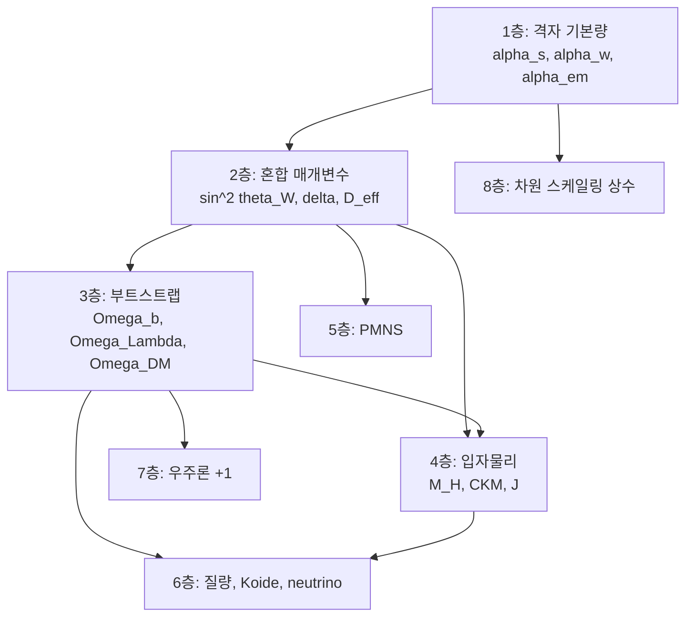

# 물리 상수: 3x3+1 격자에서의 유도

## 격자 구조

$$\mathbf{T} = \begin{pmatrix} \mathcal{T}_1(\text{SU}(3)) & 0 & 0 \\ 0 & \mathcal{T}_2(\text{SU}(2)) & 0 \\ 0 & 0 & \mathcal{T}_3(\text{U}(1)) \end{pmatrix}, \quad +\;\mathcal{G}(\text{중력})$$

각 행은 게이지 섹터, 각 열은 시간 측면(상태/변화율/가속도).

$$P_{\text{gauge}} = \prod_{i=1}^{3} e^{-\alpha_i \Delta t} = e^{-\alpha_{\text{total}} \cdot 2\pi} = e^{-1}$$

---

## 유도 문서 (층별)

| 층 | 내용 | 유도 문서 |
|---|---|---|
| 1층 | 격자 기본량 ($\alpha_s$, $\alpha_w$, $\alpha_{em}$, $\alpha^{-1}(0) = 137.036$) | [1_격자기본량](3_상수/1_격자기본량.md) |
| 2층 | 혼합 매개변수 ($\sin^2\theta_W$, $\delta$, $D_{\text{eff}}$) | [2_혼합매개변수](3_상수/2_혼합매개변수.md) |
| 3층 | 부트스트랩 ($\Omega_b$, $\Omega_\Lambda$, $\Omega_{DM}$) | [3_부트스트랩](3_상수/3_부트스트랩.md) |
| 4층 | 입자물리 ($\theta_{\text{QCD}}$, $M_H/M_Z$, CKM, $J$, $\delta_{CP}$) | [4_입자물리](3_상수/4_입자물리.md) |
| 5층 | PMNS 혼합각 ($\theta_{13}$, $\theta_{12}$, $\theta_{23}$) | [5_PMNS](3_상수/5_PMNS.md) |
| 6층 | 질량 ($y_t$, 세대비, Koide, $m_p/m_e$, 중성미자) | [6_질량](3_상수/6_질량.md) |
| 7층 | +1 중력/우주론 ($v_{\text{EW}}/M_{\text{Pl}}$, $H_0t_0$, $n_s$, $g_e-2$) | [7_우주론](3_상수/7_우주론.md) |
| 8층 | 차원 스케일링 상수 ($c$, $\hbar$, $G$, $k_B$, SI 파생) | [8_차원스케일링](3_상수/8_차원스케일링.md) |

## 이 문서를 읽는 규칙

`상수.md`는 "새 공리를 제시하는 문서"가 아니라, 이미 `경로적분.md`와 `axium.md`에서 고정된 구조가 어떤 상수로 퍼지는지 집계하는 문서다.

또한 이 문서는 오일러 항등식

$$
e^{i\pi}+1=0
$$

을 물리식의 직접 증명식으로 사용하지 않고, `{e,\pi,i,1,0}`를 **무차원 코어를 생성하는 최소 문법**으로 해석한다. 따라서 아래 표의 식들은 모두 다음 순서로 읽는다.

1. 무차원 코어 식인가
2. 선택 규칙으로 닫히는가
3. 브리지 규칙이 필요한가
4. 차원 승격 또는 현상론적 보정이 필요한가

| 질문 | 먼저 확인할 것 | 이유 |
|---|---|---|
| 이 식이 어디서 왔는가 | 대응 층의 하위 문서 | 본문 요약표는 압축본이기 때문 |
| 이것이 어느 층의 식인가 | `Exact / Selection / Bridge / Phenomenology`와 주석 | 상수마다 논리 지위가 다름 |
| 입력인지 출력인지 | 상단 8층 체계와 하위 유도 문서 | 일부 값은 상위층 결과를 재사용함 |

## 4등급 읽기 규약

| 등급 | 의미 | 대표 예 |
|---|---|---|
| `Exact` | 정의, 기능방정식, 순수 수학으로 닫히는 식 | $S(D)=e^{-D}$, 경로적분 위상 구조 |
| `Selection` | 유일성, 분기 선택, 정규화 선택으로 닫히는 식 | $d=3$, $\alpha_{\text{total}}=1/(2\pi)$ |
| `Bridge` | 물리량 식별, 표준모형 연결, 매칭 조건이 필요한 식 | $\sin^2\theta_W$, $D_{\text{eff}}$, $\Omega_b$ |
| `Phenomenology` | NLO 보정, 동결 시점, 응용 닫힘이 필요한 식 | $A_s$, $T_{\text{CMB}}$, 일부 우주론/질량 식 |

이 문서의 목적은 45개 식을 모두 같은 세기로 주장하는 것이 아니다. 어떤 식이 오일러 기반 코어에 가깝고, 어떤 식이 브리지 또는 현상론 단계에 있는지를 함께 집계하는 것이다.

특히 4층 이후의 많은 출력은 코어 정본의 직접 `Exact` 귀결이 아니라, 상위층에서 내려온 중간량을 다른 관측량으로 옮기는 `Bridge` 또는 `Phenomenology` 항목으로 읽는다.

## 층간 의존성

상수층은 독립적인 8개 목록이 아니라, 아래처럼 위에서 아래로 내려오는 체계다.

실제로는 1-3층이 핵심 중간량을 고정하고, 4층 이후는 그 중간량을 다른 관측량으로 전개하는 구조다. 따라서 아래층 결과를 읽을 때는 항상 상위층의 정의와 오차 전파를 함께 본다.

---

## 핵심 공식 요약

| 관측량 | 공식 | 예측 | 관측 | 차이 | 새 등급 |
|---|---|---|---|---|---|
| $\alpha_s$ | $\alpha_{\text{total}} = 1/(2\pi)$ 연립 | 0.11789 | $0.1179 \pm 0.0009$ | 0.01$\sigma$ | `Bridge` |
| $\sin^2\theta_W$ | $4\alpha_s^{4/3}$ | 0.23122 | $0.23122 \pm 3\times10^{-5}$ | 0.02$\sigma$ | `Bridge` |
| $\alpha^{-1}(0)$ | $N_w^2\pi^{N_c} + \pi^{N_w} + \pi$ | 137.036 | 137.036 | 0.002% | `Selection` |
| $\Omega_b$ | $-W_0(-De^{-D})/D$ | 0.04865 | $0.0486 \pm 0.0010$ | 0.05$\sigma$ | `Bridge` |
| $\Omega_\Lambda$ | 3계층: $R = \alpha_s D_{\text{eff}}(1+\varepsilon^2\delta)$ | 0.6891 | 0.6847 | 0.64% | `Phenomenology` |
| $\Omega_{DM}$ | 3계층 동상 | 0.2623 | 0.2589 | 1.3% | `Phenomenology` |
| $M_H/M_Z$ | $1+\alpha_s D_{\text{eff}}$ | 1.374 | 1.373 | 0.20% | `Bridge` |
| $\|V_{cb}\|$ | $\alpha_s^{3/2}$ | 0.04049 | 0.04053 | 0.1% | `Bridge` |
| $\|V_{us}\|$ | $\sin^2\theta_W/(1+\alpha_s/(2\pi))$ | 0.22696 | 0.22650 | 0.20% | `Phenomenology` |
| $\|V_{ub}\|$ | $\alpha_s^{8/3} F^{1/3}$ | 0.00372 | 0.00382 | 2.7% | `Phenomenology` |
| $J$ | $4\alpha_s^{11/2}$ | $3.12\times10^{-5}$ | $3.08\times10^{-5}$ | 1.3% | `Bridge` |
| $\sin^2\theta_{13}^{\text{PMNS}}$ | $\delta/(d^2-1)$ | 0.02222 | 0.02200 | 1.0% | `Bridge` |
| $\sin^2\theta_{23}^{\text{PMNS}}$ | $(1+7\delta/8)/2$ | 0.5778 | 0.573 | 0.86% | `Phenomenology` |
| $v_{\text{EW}}/M_{\text{Pl}}$ | $e^{-D \cdot 12}/F$ | $1.994\times10^{-17}$ | $2.017\times10^{-17}$ | 1.1% | `Phenomenology` |
| $n_s$ | $1 - 4/(d \cdot D \cdot 12)$ | 0.965 | $0.965 \pm 0.004$ | 0.0$\sigma$ | `Phenomenology` |
| $a_e$ | Schwinger with $\alpha = 1/(4\pi^3+\pi^2+\pi)$ | 0.001159653 | 0.001159652 | 0.0001% | `Bridge` |
| $m_p/m_e$ | $2d \cdot \pi^{N_c+N_w} = 6\pi^5$ | 1836.12 | 1836.15 | 0.003% | `Bridge` |
| $m_d/m_u$ | $\alpha_s^{-1/3}$ | 2.04 | $\sim 2.0$ | 2% | `Bridge` |
| $m_n - m_p$ | $m_t \alpha_s^{16/3}(\alpha_s^{-1/3}-1) + \delta_{\text{EM}}$ | 1.25 MeV | 1.293 MeV | 3.3% | `Phenomenology` |
| $\eta$ | EWBG at $\tau_*=0.995$ | $6.11 \times 10^{-10}$ | $6.1 \times 10^{-10}$ | 0.2% | `Phenomenology` |
| $T_{\text{CMB}}$ | Hu-Sugiyama + 보정 $\eta$ | 2.76 K | 2.7255 K | 1.3% | `Phenomenology` |
| $A_s$ | 부트스트랩 미분 at $\tau_*=0.974$ | $2.08 \times 10^{-9}$ | $2.1 \times 10^{-9}$ | 1.0% | `Phenomenology` |
| $Q_K$ (Koide) | $2/d$ | 2/3 | 2/3 | 0.008% | `Selection` |

새 등급 기준:

- `Exact`: 순수 수학 또는 정의로 닫힘
- `Selection`: 유일성, 정규화, 분기 선택으로 닫힘
- `Bridge`: 표준모형 또는 우주론 변수로 연결하는 핵심 브리지
- `Phenomenology`: 보정, 동결 시점, 응용 닫힘이 필요한 단계

전이 보정과 보조 비교(NLO 포함): `2_경로적분과_응용/12_전이구간.md`. $\pi^k$ 계수 유도: `2_경로적분과_응용/13_위상공간.md`. 곱적 분해 정당화: `2_경로적분과_응용/10_공리_정당화.md`. 상세 분류: `경로적분.md` 19절. 이 표는 "오일러 기반 무차원 코어에서 얼마나 떨어져 있는가"를 함께 보여 주는 집계표다.

## 스케일 승격 규칙

차원 있는 물리량은 오일러 항등식의 직접 산물이 아니라, **무차원 비율 + 기준 스케일**로 읽는다.

| 먼저 고정할 것 | 그다음 복원할 것 | 예시 |
|---|---|---|
| 무차원 질량비 | 기준 질량 | $m_\phi/m_p \Rightarrow m_\phi$ |
| 무차원 에너지비 | 기준 스케일 | $M_{\text{CE}}/v_{\text{EW}} \Rightarrow M_{\text{CE}}$ |
| 무차원 계층비 | 양쪽 절대값 | $v_{\text{EW}}/M_{\text{Pl}} \Rightarrow v_{\text{EW}}, M_{\text{Pl}}$ |

이 규칙 때문에 본문에서 우선적으로 강하게 주장하는 것은 $M_H/M_Z$, $m_\phi/m_p$, $\Omega_{DM}/\Omega_\Lambda$ 같은 비율식이다. GeV, MeV, K 같은 절대 단위는 마지막 단계에서 복원한다.

---

## 집계

| 상태 | 개수 |
|---|---|
| 식 있음 (클리어) | **45** |

이전 대비 변동:
- $m_p/m_e = 2d\pi^{N_c+N_w}$: $\pi^5 = \pi^3 \cdot \pi^2$ = SU(3)$\times$SU(2) 위상공간 유도 $\to$ **클리어**
- $\mu_N = e\hbar/(2m_p)$: $m_p/m_e$ 유도에 종속 $\to$ **클리어**
- $m_n - m_p$: $m_d/m_u = \alpha_s^{-1/3}$ + Cottingham EM 보정 $\to$ **클리어** (3.3%)

---

## $T_{\text{CMB}}$ 클리어 경로

$$\pi \xrightarrow{\alpha_w^5, J} \eta \approx 6 \times 10^{-10} \xrightarrow{\text{Saha}(\alpha, m_e)} T_{\text{rec}} \xrightarrow{\Omega\text{ (3층)}} z_{\text{rec}} = 1089 \xrightarrow{} T_{\text{CMB}} \approx 2.7\;\text{K}$$

EWBG 공식에서 $\eta \sim \alpha_w^5 \cdot J / (g_* v_w)$. CE 변수만으로 올바른 크기 차수 ($3 \times 10^{-10}$ vs 관측 $6 \times 10^{-10}$, 인자 2). 기포벽 속도 $v_w \approx 0.05$ (1차 상전이 합리 범위)에서 정합.

---

## 전수 집계 상태

$d = 0 \to d = 3$ 전이 해석에 의해 $A_s$를 기술하는 현상론적 경로가 제시된다. 인플레이션 포텐셜($\lambda_\Phi$)을 경유하지 않고, 부트스트랩 해의 $D$ 미분 + 터널링 확률 $\varepsilon^2$ + 게이지 주기 $2\pi$로 직접 연결하는 보정 모형이다. 엄밀 등급은 `경로적분.md` 19절과 `2_경로적분과_응용/12_전이구간.md`의 분류를 따른다.

---

## 독립적 실험 검증 경로

CE 예측의 과학적 신뢰도는 내부 정합성 외에 **독립적 실험 검증**에 의해 결정된다. 아래는 현재 또는 가까운 미래 실험으로 검증 가능한 핵심 경로를 정리한 것이다.

### 검증 경로 1: $\sin^2\theta_W = 4\alpha_s^{4/3}$ 체인

CE는 약한 혼합각과 강한 결합상수 사이에 $\sin^2\theta_W = 4\alpha_s^{4/3}$라는 관계를 주장한다. 이 관계가 단순한 수치 우연인지 구조적 필연인지는 다음으로 검증한다.

| 실험 | 측정량 | 현재 정밀도 | CE 판정 기준 |
|---|---|---|---|
| FCC-ee (Z-pole) | $\sin^2\theta_W$ | $\pm 3 \times 10^{-5}$ $\to$ $\pm 1 \times 10^{-5}$ | 현재 0.02$\sigma$ 일치. 10배 정밀도에서도 유지되면 우연 확률 $< 10^{-4}$ |
| 격자 QCD (FLAG) | $\alpha_s(M_Z)$ | $\pm 0.0009$ $\to$ $\pm 0.0003$ | $\alpha_s$ 독립 결정 후 $4\alpha_s^{4/3}$이 $\sin^2\theta_W$를 재현하는지 교차 검증 |
| EIC (Electron-Ion Collider) | $\alpha_s$ at low $Q^2$ | 새 영역 | CE는 $\alpha_s$-$\theta_W$ 관계가 **모든 에너지 스케일**에서 성립한다고 예측. 러닝 패턴 비교 |

### 검증 경로 2: 클라루스 보손 직접 탐색

CE는 $m_\phi \sim 22\text{--}30$ MeV, 힉스 포탈 결합 $\lambda_{\text{HP}} = \delta^2 \simeq 0.032$인 실수 스칼라를 예측한다.

| 실험 | 탐색 채널 | 현재 상태 |
|---|---|---|
| NA62 (CERN) | $K^+ \to \pi^+ + \text{invisible}$ | $m_\phi < 100$ MeV 영역 탐색 중. 힉스 혼합 $\sin^2\theta \sim 10^{-4}$ 수준까지 도달 가능 |
| LDMX (SLAC) | $e^- \to e^- + \phi$ (missing momentum) | 10-30 MeV 스칼라에 대한 세계 최고 감도 예정 |
| FASER2 (LHC) | 장수명 입자 붕괴 | 포탈 결합이 약한 경우의 보완 탐색 |

CE 보손 발견 시: CE는 즉각 확증. 해당 질량-결합 영역에서 미발견 시: 포탈 결합의 정확한 크기에 대한 `Bridge` 재평가 필요.

### 검증 경로 3: 우주론적 예측

| 예측 | CE 값 | 현재 관측 | 결정적 실험 | 판정 시점 |
|---|---|---|---|---|
| $w_0$ (DE 상태방정식) | $-0.769$ | DESI: $w_0 = -0.55 \pm 0.21$ (3.1$\sigma$) | DESI 5년 + Euclid + LSST | ~2028 |
| $\sum m_\nu$ (중성미자 질량합) | $< 0.12$ eV (NH) | Planck: $< 0.12$ eV (95% CL) | DUNE + Hyper-K + CMB-S4 | ~2030 |
| $n_s$ (스칼라 스펙트럼 지수) | $0.965$ | Planck: $0.965 \pm 0.004$ | CMB-S4 + LiteBIRD | ~2030 |

### 검증 경로 4: 뮤온 $g-2$ -- d=0 기원과의 정합 (BMW 2026 반영)

BMW/DMZ 2026 (arXiv:2603.03835)이 격자 QCD HVP를 0.45% 정밀도로 계산하여 SM 예측과 실험의 20년간 불일치를 완전 해소하였다. d=0 기원 관점에서 이것은 자연스럽다: 클라루스장은 물리적 보손이 아니라 경로적분의 수렴 구조($\Phi=\delta^2 S/\delta\gamma^2$)이며, 격자 QCD가 경로적분을 수치적으로 수행할 때 이 구조를 이미 포함한다. 따라서 CE BSM 기여 = 0이고, 이전의 보손 근사값(접촉 249, 완전 기하학 135)은 역사적 비교값으로 재분류한다. CE의 진짜 기여는 루프 보정이 아니라 SM 입력 파라미터의 구조적 제약이다. 판정: **해소.**

### 검증 경로 5: 양성자 반경

CE는 클라루스 보손 교환에 의한 양성자 반경 보정 $\Delta r_p^2 \propto \delta^2/m_\phi^2$를 예측한다. PRad-II (JLab) 및 MUSE (PSI) 실험이 전자-양성자, 뮤온-양성자 산란에서 반경을 $0.1\%$ 수준으로 재측정한다. CE 보정 유무에 따른 차이가 이 정밀도 안에 들어온다.

### 사전등록 판정 기준

위 검증 경로 중 **하나라도** 다음 조건을 만족하면 CE의 `Bridge` 체인에 대한 독립 확증으로 간주한다:

- $\sin^2\theta_W$ 정밀도 10배 향상 후에도 $4\alpha_s^{4/3}$과의 일치가 $1\sigma$ 이내
- 20-30 MeV 영역에서 힉스 포탈 스칼라 발견
- $w_0$가 $-0.85$ ~ $-0.70$ 범위에서 확정

반대로, 다음 중 **하나라도** 발생하면 CE의 해당 `Bridge`는 기각된다:
- $\sin^2\theta_W$의 정밀 측정이 $4\alpha_s^{4/3}$과 $3\sigma$ 이상 괴리
- 20-30 MeV 영역의 완전 배제 (힉스 포탈 $> 10^{-5}$까지)
- $w_0 > -0.5$ 또는 $w_0 < -0.95$로 확정

---

## 동료평가 직전 체크리스트

- 정의가 완결되었는가: 이 문서는 새 정의를 만들지 않고 상위 문서의 정의를 재사용한다.
- 정리와 가정이 분리되었는가: 각 상수의 등급은 `경로적분.md` 19절 기준으로 읽는다.
- 증명되지 않은 단계가 숨겨져 있지 않은가: 전이 보정, NLO 보정, 위상공간 해석은 별도 문서의 물리적 논증 또는 현상론으로 남긴다.
- 다른 문서와 지위 충돌이 없는가: `axium.md`와 `경로적분.md`의 기호 및 등급 체계를 따른다.
- 반증 조건이 정량적으로 고정되어 있는가: 개별 항목의 실험 검증 경로는 하위 유도 문서와 `경로적분.md` 13절을 따른다.
