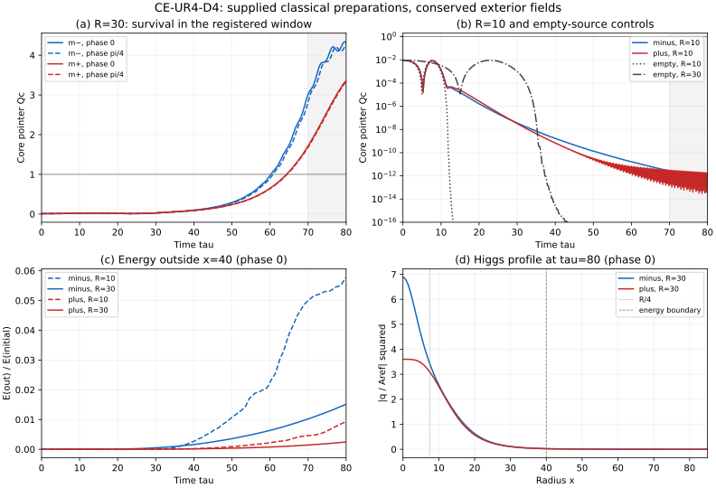

# 78. 유한 기록원의 방사와 전체 공간 에너지

## 78.1 계산 전 등록: CE-UR4-D4

**[후보: 같은 작용의 유한 원천과 보존되는 바깥 장]** 77장의 다섯
복소장에 구면 대칭 공간 gradient를 복원한다. 전체 82성분 작용,
결합·질량·진공은 바꾸지 않는다. 바깥 장의 에너지를 흡수하거나 임의
감쇠항을 넣지 않는다. 주어진 고전 초기 원천을 실제 양자 준비나 관측
확정 사건으로 동일시하지 않는다.

1. 좌표 $x=m_{\rm ref}r$, $\tau=m_{\rm ref}t$와 77장의 공통
   $n_0,A_{\rm ref},m_\pm$를 사용한다. 원천 profile은
   $f_R(x)=\exp[1-1/(1-(x/R)^2)]$ for $0\le x<R$, 바깥에서는 0이다.
   $R=10,30$을 계산 전에 고정한다. 각 $R$에서 두 질량과
   $\theta=0,\pi/4$를 모두 검사해 여덟 경우를 얻는다.
2. 초기 light 장은 $s=A_\alpha f_R e^{i\theta}$,
   $\dot s=-im_\alpha s$, $q=0.1A_{\rm ref}f_R$, $\dot q=0$다.
   heavy 장은 각 위치의 light 값을 고정한 local potential의
   진공 연결 정상점, 속도는 그 접공간에서 정한다. gradient 에너지는
   처음부터 전체 장부에 포함한다. 이를 공간적으로 정지한 원천 해로
   부르지 않는다. 이후에는 다섯 장 모두 공간 운동식으로 진화한다.
3. 동일한 두 profile과 동일 $q$ seed를 사용하되 $s=u=0$인
   빈 기록원 대조군 두 개도 같은 작용으로 계산한다. 이는 추가 피팅이
   아니며, 초기 seed 자체의 방사와 원천이 있을 때의 결과를 구분한다.
   seed 0의 불변 해를 양자 진공의 무사건 확률로 사용하지 않는다.
4. 계산 영역은 $0\le x\le140$, 시간은 $0\le\tau\le80$다.
   원점 정칙성과 외곽 Neumann 조건을 쓴다. continuum에서는 가장
   바깥 초기 support 30에서 외곽까지 걸리는 시간 110이 관측 창보다
   길다. 수치 외곽 꼬리도 검사하고, 한 기준 경우
   $m_-,R=30,\theta=0$을 외곽 160에서 독립 비교한다.
5. 실제 gradient·potential·kinetic 에너지를 모두 남기는 구면
   finite-volume Hamiltonian을 사용한다. 셀 중심값, 정확한 구면
   셀 부피와 인접 면의 gradient 항으로 양의 전체 에너지를 정의한다.
   셀에 절반씩 나눈 면 에너지와 경계 current로 내부/외부 에너지
   교환을 독립 검산한다. 관측 경계는 두 원천 모두 $x=40$으로 고정한다.
6. 시간 적분은 전체 quartic potential의 gradient를 단계 사이에서
   정확히 평균하는 implicit discrete-gradient 방법으로 수행한다.
   무거운 장을 제거하거나 매 순간 다시 최소화하지 않는다.
   공간/시간 간격 $(\Delta x,\Delta\tau)=(0.5,0.04),(0.25,0.02)$를
   비교하고 실패한 경우만 더 세밀하게 한다. 에너지·경계 flux 잔차는
   초기 전체 에너지 대비 $10^{-6}$, 관측량 차이는
   $|a-b|/\max(1,|b|)\le0.005$를 요구한다. 시공간 수렴과 별도로
   균일 극한을 77장의 DOP853과 비교하고, 자유 구면 파동의 해석해를
   검사한다. 무거운 빠른 위상의 장시간 정밀 재현은 별도 오차를
   기록하며, 에너지 보존만으로 시간 정확도를 대체하지 않는다.
7. 국소 pointer는 $R_c=R/4$ 안의 부피 평균
   $Q_c=3R_c^{-3}\int_0^{R_c}x^2|q|^2/A_{\rm ref}^2\,dx$다.
   문턱 1의 통과·재하강과 마지막 구간 $\tau\in[70,80]$의 유지 여부,
   peak 및 마지막 최소·최대를 모두 기록한다. 경계 $x=40$ 밖의
   전체 에너지, $F_q$ index에 배정한 Higgs 부분 에너지와 signed
   누적 에너지 flux도 계산한다. 이 분할은 유일한 입자 에너지 분해가
   아니다. 바깥 에너지를 삭제하지 않으며 역류를 숨기지 않는다.
8. 여덟 원천과 두 대조군을 모두 보존한다. 유지에 성공한 경우도
   관측 창에서만 생존이며 영구 기록이나 실제 확정을 증명한 것이
   아니다. 실패한 경우는 해당 준비 분기로 보존하고 피팅으로 봉합하지
   않는다. 공간 수렴이 문턱 판정을 지지하지 않으면 판정을 유보한다.

사전 등록을 해시로 고정한 뒤 수치 계산한다. 새 관측 자료·보정 피팅은
없다. scientific_success=false, full_joint_rmse=null이다. 공통 양자·중력
극한과 실제 비동기 기록은 이 고전 방사 계산으로 달성 선언하지 않는다.

## 78.2 검산 결과

### 78.2.1 고정된 작용과 이산 에너지

**[정의·조건부 유도]** 계산 전 등록 §78.1의 UTF-8/LF 정규화 SHA-256은
`d92d6f7545b0754a3641393446799c71de9beb622246ee8a5f2950e32e2a520e`다.
이 절 이후의 결과를 추가해도 해당 등록 구간은 바꾸지 않는다.
구현은 [공간 적분기](../../verify/ce_record_radiation.py), 별도 산술 검산과
77장 장시간 대조는 [독립 검산기](../../verify/ce_record_radiation_audit.py)에 있다.

다섯 복소장을 $A_{\rm ref}$로 나눈 실수 열 성분을 $y_i$, 그
$\tau$ 미분을 $v_i$라 쓰고 $U(y)=\sum_a|F_a(A_{\rm ref}y)|^2/
(A_{\rm ref}m_{\rm ref})^2$로 정의한다. $F$는 77장의 원래 다항식이다.
셀 부피 $\Omega_i=(x_{i+1/2}^3-x_{i-1/2}^3)/3$와 면 계수
$k_{i+1/2}=x_{i+1/2}^2/\Delta x$로 무차원 에너지는

$$
\mathcal E=\sum_i\Omega_i\bigl(v_i\cdot v_i+U(y_i)\bigr)
+\sum_{i}k_{i+1/2}|y_{i+1}-y_i|^2.
$$

물리적 에너지는 사용한 원래 단위에서 $4\pi A_{\rm ref}^2
\mathcal E/m_{\rm ref}$다. Neumann 외곽과 원점의 면 계수는 0이다.
이 양의 장부에서 변분하면

$$
\dot y_i=v_i,\qquad \dot v_i=(Ly)_i-g(y_i),\quad
g=\tfrac12\nabla_{\mathbb R}U,
$$

$$
(Ly)_i=\Omega_i^{-1}\{k_{i+1/2}(y_{i+1}-y_i)
-k_{i-1/2}(y_i-y_{i-1})\}
$$

를 얻는다. 고정된 선형 다섯 장 매장은 공간 미분과 교환한다.
82성분 작용으로의 force closure와 매장된 gauge 생성자 0을 다시 검사하므로,
이 매장 안의 공간 변화가 생략한 gauge current를 새로 만들지 않는다.
이는 이 불변 부분공간의 고전 계산이며 임의의 82성분 초기상태에 대한 결과는 아니다.

시간 적분에는 [Celledoni 외의 AVF 방법](https://arxiv.org/abs/1202.4555)을 사용한다.
단계 평균을 $\bar y=(y^{n+1}+y^n)/2$, $\bar v=(v^{n+1}+v^n)/2$라 하면

$$
\Delta y=h\bar v,\qquad
\Delta v=h\{L\bar y-\bar g\},\qquad
\bar g=\int_0^1g(y^n+c\Delta y)\,dc
=\tfrac12\sum_{c=1/2\pm\sqrt3/6}g(y^n+c\Delta y).
$$

$U$가 quartic이므로 두 Gauss 점은 이 적분에 정확하다.
$\Delta U=2\bar g\cdot\Delta y$와 면별 summation by parts를 대입하면
전체 $\Delta\mathcal E=0$이다. 실제 계산은 이 비선형 식의 Newton 잔차와
부동소수점 오차를 별도로 측정한다. 매 단계 heavy 장을 제거하거나
local minimum으로 되돌리지 않는다.

면 에너지의 절반씩을 인접 셀에 주면 한 면을 지나는 바깥 방향 current는

$$
J_{i+1/2}=-k_{i+1/2}(\bar y_{i+1}-\bar y_i)
\cdot(\bar v_{i+1}+\bar v_i).
$$

따라서 $x=40$ 밖의 에너지 변화는 $hJ_{40}$다. signed 적분 외에도
양의 유출과 음의 역류를 각각 보존한다. $F_q$ 항에 배정한 부분 에너지는
개별 보존량이 아니므로 이를 전체 경계 current와 동일시하지 않는다.

### 78.2.2 수치 검산의 범위

**[산출: 구현 검산]** 무작위 복소장 단계의 이산 chain rule·경계 교환,
자유 구면 파동의 해석해, 균일계의 DOP853을 서로 대조한다.
균일계는 짧은 $\tau\le4$ 구간의 새 DOP853 실행과 77장의 고정된
$\tau\le60$ 결과를 모두 사용한다. 원래 77장 결과·코드는 변경하지 않는다.

자유 파동 검산은 $w=xq$, 초기 $w_0(x)=x\exp[-(x/3)^2]$의 홀수 연장을
사용한 $q(x,\tau)=[w_0(x-\tau)+w_0(x+\tau)]/(2x)$와 비교한다.
장 에너지 산술의 독립 검산은 적분기의 에너지 함수를 부르지 않고 저장된
최종 장과 원래 $F_a$ 다항식에서 전체·바깥·Higgs 배정량을 재구성한다.

빈 기록원은 실수 $z,t,q$와 $s=u=0$인 정확한 불변 부분공간에 있다.
다항식의 실수 계수와 $s,u$의 운동식에서 일곱 나머지 실수 성분의 힘이
항등적으로 0임을 확인한다. 마지막 세분화의
[빈 원천 계산기](../../verify/ce_record_radiation_empty_refinement.py)는
같은 AVF Newton 선형계에서 이 영 성분만 제외한다. heavy $z,t$와
그 속도는 계속 진화하며, 매 순간 최소화하거나 유효 potential로 바꾸지 않는다.
초기화·전체 다섯 장 저장·flux 계산은 원래 계산기를 그대로 쓴다.
에너지는 같은 전체 다항식을 이 불변 부분공간에서 직접 평가하며, 원래
계산기와 무작위 상태의 셀별 에너지를 비교한 scaled 차이는
$2.25\times10^{-16}$ 미만이다.
원래 열 성분 풀이와 $\tau=80$까지 비교한 관측량 최대 차이는
$4.45\times10^{-16}$ 미만, 최종 장·속도 차이는 $1.19\times10^{-16}$
미만이다. 따라서 이는 새로운 준비 가정이 아니라 정확한 영 좌표를 이용한
동일 이산 방정식의 풀이이며, 두 구현의 해시를 함께 남긴다.

빠른 heavy 위상은 분해능 밖이다. 진공의 선형 진동수 $\omega$에 대해
AVF는 $\widetilde\omega=2\arctan(h\omega/2)/h$를 가지므로,
위상 누적 오차 $80(\widetilde\omega-\omega)$를 별도 기록한다.
이는 full nonlinear 해의 장 진폭 오차와 구별되는 선형 진단이다.
국소 pointer 및 에너지 수렴을 통과하더라도 모든 빠른 위상을 정밀
재현했다고 주장하지 않는다.

수렴 비교의 관측량은 $Q_c$, $E_{\rm out}/E_0$,
$E_{q,\rm out}/E_0$, $\int J_{40}d\tau/E_0$다. 각 격자의 초기 전체
에너지를 $E_0$로 쓰며, 모든 저장 시간점에서 등록한
$|a-b|/\max(1,|b|)$를 적용한다. 에너지 분율의 오차는 초기 전체
에너지에 대한 비율이고, 작은 방사 성분 자체의 상대 오차와 같지 않다.
$Q_c\ll1$인 마지막 미세 꼬리 역시 그 작은 값의 상대 정밀도까지
보장한 것이 아니다. 표의 자릿수는 재현을 위한 산출값이다.

| 검산 | 산출 |
|---|---:|
| 82성분 작용의 매장·힘·독립 미분 등 최대 scaled 잔차 | $4.92\times10^{-13}$ 미만 |
| AVF quartic chain rule 잔차 | $2.17\times10^{-16}$ |
| 별도 Hessian과의 상대 차이 | $2.81\times10^{-16}$ 미만 |
| 무작위 단계의 경계 에너지 교환 상대 잔차 | $2.17\times10^{-16}$ 미만 |
| 자유 구면 파동의 부피 가중 상대 $L^2$ 오차, $\Delta x=0.5,0.25,0.125$ | $0.0333631,\ 0.00837004,\ 0.00209418$ |
| 균일계 $\tau\le60$, $h=0.02$에서 DOP853 대비 최대 pointer scaled 차이 | $0.00112455$ 미만 |
| 같은 균일계 $h=0.01$의 최대 pointer scaled 차이 | $0.000281077$ 미만 |
| 외곽 $140\to160$ 대조의 pointer 차이 | 저장된 시간점에서 0 |
| 같은 외곽 대조의 바깥 에너지 분율 차이 | $8.68\times10^{-18}$ 미만 |

자유 파동의 세 격자 오차는 약 4배씩 감소한다. 반면 $h=0.02$의 heavy
진공 선형 진동수 상대 오차는 질량 $1,4,5$에 대해 각각 약
$-94.73\%,-98.66\%,-98.93\%$다. 따라서 작은 pointer 오차와 큰 빠른
위상 오차를 함께 남긴다. 이 구분 없이 전체 장의 위상까지 수렴했다고
읽으면 안 된다.

### 78.2.3 원천 크기와 pointer

**[산출: 조건부 고전 공간 진화]** 아래 여덟 원천은 각각 마지막 두 격자의
관측량 수렴을 통과했다. $R=10$의 네 경우는 문턱에 도달하지 않는다.
$R=30$의 네 경우는 $\tau\simeq60$–65에 문턱을 넘어 마지막 창
$[70,80]$의 모든 저장점에서 문턱 위에 남는다. 재하강은 이 창 안에서
관측되지 않았다. 전체 시계열과 최종 공간 장은
[수치 원장](../../verify/ce_record_radiation.json)에 보존한다.

| 질량 | $R$ | $\theta$ | 최종 $\Delta x$ | $Q_c$ peak | $[70,80]$ 최소–최대 | 첫 상향 통과 $\tau$ |
|---|---:|---:|---:|---:|---|---:|
| $m_+$ | 10 | 0 | 0.25 | 0.00925575 | $3.01\times10^{-14}$–$3.10\times10^{-12}$ | 없음 |
| $m_+$ | 10 | $\pi/4$ | 0.25 | 0.00925575 | $3.01\times10^{-14}$–$3.10\times10^{-12}$ | 없음 |
| $m_-$ | 10 | 0 | 0.125 | 0.00925187 | $5.46\times10^{-13}$–$2.63\times10^{-12}$ | 없음 |
| $m_-$ | 10 | $\pi/4$ | 0.125 | 0.00925187 | $5.38\times10^{-13}$–$2.59\times10^{-12}$ | 없음 |
| $m_+$ | 30 | 0 | 0.125 | 3.353690 | 1.710832–3.353690 | 64.348315 |
| $m_+$ | 30 | $\pi/4$ | 0.125 | 3.335054 | 1.685053–3.335054 | 64.533218 |
| $m_-$ | 30 | 0 | 0.25 | 4.339524 | 3.012570–4.339524 | 60.192640 |
| $m_-$ | 30 | $\pi/4$ | 0.25 | 4.288490 | 2.823137–4.288490 | 60.749659 |

**유지의 의미.** 큰 원천의 마지막 최소는 1보다 충분히 크지만, 값 자체는
마지막 창에서도 크게 변한다. $m_-,\theta=0$의 peak 시점은
$\tau=79.64$이고 나머지 세 경우의 peak는 종료 시점 80이다.
따라서 관측 창에서의 생존은 확인되지만, 안정된 plateau나 긴 시간의
정착을 확인한 것은 아니다. 77장의 균일 D3 반례를 지우지 않으며,
공간적 준비 D4의 유한 창 결과로 적용 범위를 구분한다.

### 78.2.4 바깥 장의 에너지와 대조군

$R=30$의 종료 시점 바깥 에너지 분율은 다음과 같다. 분자는 $x=40$
밖의 실제 장 에너지이고, Higgs 열은 지정한 $F_q$ 배정량이다.
여기서 방사는 계산한 다섯 scalar 장의 공간 전파량이며, 광자 생성률이나
fermion 출력률을 계산한 것은 아니다.

| 질량·위상 | $E_{\rm out}/E_0$ | $E_{q,\rm out}/E_0$ |
|---|---:|---:|
| $m_+,0$ | 0.00246658 | 0.000459072 |
| $m_+,\pi/4$ | 0.00246290 | 0.000452539 |
| $m_-,0$ | 0.01515226 | 0.000897332 |
| $m_-,\pi/4$ | 0.01511958 | 0.000850230 |

각 원천의 전체 에너지 대부분은 여전히 $x=40$ 안에 있다. 따라서
pointer 유지의 이유를 바깥으로의 에너지 방출 하나로 확정하지 않는다.
공간 재분배와 원천의 되먹임을 포함한 같은 운동식의 결과이며,
지연된 증폭인지 지속적인 시간 의존 상태인지는 다음 검사의 질문이다.

두 빈 기록원도 문턱에 도달하지 않는다. 마지막 격자에서 $R=10,30$의
$Q_c$ peak는 각각 0.0092506523, 0.0092507154다. 마지막 창의 최대값은
각각 약 $1.78\times10^{-26},1.44\times10^{-19}$이며, 이 미세 꼬리의
상대 정밀도를 주장하지 않는다. 두 경우 모두 종료 시점에는 초기 에너지의
거의 전부가 $x=40$ 밖에 있다.

바깥 방향 누적량과 역류의 양의 크기를 따로 더하면 $R=10$은
$1.0000372602$와 $0.0000372602$, $R=30$은 $1.0009885669$와
$0.0009885670$이다. 모두 초기 전체 에너지로 나눈 수치다. 차이는 약 1이며,
방향별 적분이 1보다 크다는 이유로 에너지가 새로 생긴 것으로 읽지 않는다.
작은 역류까지 포함한 signed flux가 실제 바깥 에너지 변화와 일치한다.

**[산출: 등록된 수치 기준 충족]** 기본 두 격자의 20개 실행, 외곽 대조 1개,
실패한 경우만 세분화한 8개를 합해 총 29개 공간 결과를 보존한다.
첫 비교에서 원천 네 경우와 빈 원천 두 경우가 기준을 넘었다.
대부분 $(\Delta x,h)=(0.125,0.01)$에서 통과했으며, 빈 $R=10$은
$(0.0625,0.005)$와 $(0.03125,0.0025)$의 마지막 비교까지 필요했다.
이 대조군의 바깥 에너지 최대 차이는 순서대로
$0.0845676,0.0396141,0.0122742,0.00263714$로 줄었다.
이전 실패 비교도 수치 원장의 `earlier_comparisons`에 남긴다.

| 최종 검사 범위 | 최대 잔차 또는 차이 | 등록 기준 |
|---|---:|---:|
| 29개 공간 결과의 전체 에너지 | $2.463\times10^{-12}$ 미만 | $10^{-6}$ |
| $x=40$ 바깥 에너지와 signed 경계 flux | $1.498\times10^{-12}$ 미만 | $10^{-6}$ |
| 열 경우의 마지막 두 격자 관측량 | 0.00263715 미만 | 0.005 |
| 외곽 마지막 폭 5의 에너지 분율 | $8.85\times10^{-57}$ 미만 | 꼬리와 외곽 이동 대조 |

29개 최종 장의 에너지는 별도 다항식 산술로 다시 검사했다.
모든 비교에서 문턱 유지 판정도 일치한다. 이 수치 기준은 등록된 고전
관측량의 유한 시간 계산을 지지하며, 빠른 heavy 위상·영구 기록·양자
확정·전체 공동 관측의 완성을 뜻하지 않는다.



그림의 각 곡선은 해당 경우의 마지막 격자를 사용한다. (a)의 회색 창은
$[70,80]$, (b)는 작은 원천과 두 빈 원천, (c)는 위상 0의 바깥 전체
에너지, (d)는 종료 시점의 Higgs profile이다. 작은 꼬리의 상대 정밀도나
이 시간 이후의 생존을 그림에서 추론하지 않는다.

### 78.2.5 재현과 파일 경계

[전체 결과](../../verify/ce_record_radiation.json),
[독립 검산 결과](../../verify/ce_record_radiation_audit.json),
[빈 원천의 정확한 영 좌표 검산·세분화](../../verify/ce_record_radiation_empty_refinement.json)를
함께 읽는다. 결과에는 원래 계산기·등록 구간·추가 계산기의 SHA-256과
Python 및 수치 라이브러리 판본을 남긴다. 원래 77장 계산기와 수치 결과는
수정하지 않았다. 77·78장 등록 구간의 해시는 모두 유지된다.

저장소 루트의 PowerShell 재현 순서는 다음과 같다. 이미 저장된 격자는
해시를 확인한 뒤 재사용하며, `--refine`은 현재 기준을 넘은 경우만 줄인다.

```powershell
$ceD4Env = @('--no-project', '--python', '3.11.15', '--link-mode', 'copy', '--with', 'numba==0.67.0', '--with', 'numpy==2.4.6', '--with', 'scipy==1.17.1', '--with', 'sympy==1.14.0')
uv run @ceD4Env python -X utf8 -B verify/ce_record_radiation.py --checks --suite --workers 2
uv run @ceD4Env python -X utf8 -B verify/ce_record_radiation_audit.py --homogeneous --refine verify/ce_record_radiation.json --spatial verify/ce_record_radiation.json --workers 2
uv run @ceD4Env python -X utf8 -B verify/ce_record_radiation_audit.py --refine verify/ce_record_radiation.json --spatial verify/ce_record_radiation.json --workers 1
uv run @ceD4Env python -X utf8 -B verify/ce_record_radiation_empty_refinement.py
uv run @ceD4Env python -X utf8 -B verify/ce_record_radiation_empty_refinement.py --admit
uv run @ceD4Env --with matplotlib==3.10.8 python -X utf8 -B verify/ce_record_radiation_audit.py --spatial verify/ce_record_radiation.json --figure verify/ce_record_radiation.json
```

저장소·문서 대표 검사 두 파일은 13개 통과, 3개 실패다. 실패한 세 검사는
이번에 수정하지 않은 문서들의 과거 `fail` 표기, 수식 구분자, 사라진 상대 링크를
지적하며 변경 전후에 같다. 이번 장의 수치 수렴과 기존 문서 회귀 상태를
혼동하지 않는다. 전체 회귀를 통과했다고 선언하지 않는다.

## 78.3 시간 독립인 국소 장에 대한 제약

**[정리: 조건부]** 같은 다섯 canonical 복소장, $V=\sum_a|F_a|^2\ge0$,
3차원 무한 공간, 일정한 진공으로 가는 경계조건, 유한 에너지를 가정한다.
공간 dilation이 허용되는 충분히 매끄러운 정적 장에 대해, 외부에 고정한
원천·경계 지지·추가 gauge 장이 없다면 비자명한 국소 정적 정상점은 없다.

**유도.** $\phi_\lambda(\mathbf x)=\phi(\mathbf x/\lambda)$로 놓고

$$
T=\int_{\mathbb R^3}\sum_a|\nabla\phi_a|^2\,d^3x\ge0,
\qquad P=\int_{\mathbb R^3}V(\phi)\,d^3x\ge0
$$

라 하면 변수 변환만으로 $E[\phi_\lambda]=\lambda T+\lambda^3P$다.
정적 해는 이 변분에도 정상이어야 하므로 $T+3P=0$이고, 따라서
$T=P=0$이다. 경계조건 아래 장은 공간적으로 일정한 진공이다.
이는 [Derrick의 dilation 논증](https://doi.org/10.1063/1.1704233)을
여기서 사용한 양의 다섯 장 potential에 적용한 것이다.

이 결과는 시간 의존 진동·회전·준안정 국소 상태를 배제하지 않는다.
유한 Neumann 상자에 dilation을 그대로 적용한 정리도 아니며,
전체 CE의 gauge·중력 배치를 금지한 정리도 아니다. 따라서 78.2의
유한 시간 pointer가 남더라도 전체 다섯 장이 시간 독립인 국소 정상해를
형성했다고 부를 수 없다. $|q|^2$가 일정해도 장의 위상은 움직일 수 있으므로
이 정리는 모든 일정한 pointer를 배제하지 않는다. 같은 작용 안에서는
시간 의존 상태의 생존 기간과 재하강을 더 검사해야 한다.
유한 영역에 대한 경계항의 중요성은 [Adib의 확장](https://arxiv.org/abs/hep-th/0208168)과도 구분해 읽는다.

## 78.4 다음 검증의 질문과 남은 목표

**[미완성]** 다음 질문은 $R=30$에서 남은 pointer가 더 긴 시간에도
유지되는지, 아니면 늦어진 증폭과 재하강의 일부인지다. 다음 실행에서는
같은 네 초기 원천과 $R=30$ 빈 대조군, 같은 $Q_c=1$ 문턱을 유지한다.
종료 시간을 $\tau=240$으로 늘리고 마지막 창을 $[230,240]$으로 두는
검사를 계산 전에 별도 등록한다. 외곽은 최소 300으로 옮겨 초기 support에서
외곽까지의 continuum 이동 시간 270이 관측 창보다 길게 하고, 바깥으로
나간 장과 역류를 계속 보존해야 한다. 78장의 $\tau=80$ 결과를 보고
원천 크기·밀도·seed·위상·coupling을 다시 적합하지 않는다.

이 시간 연장은 아직 실행하지 않았다. 장시간 수렴과 생존을 확인한 후에도
주어진 고전 seed의 실제 양자 준비, 비관측 성분을 포함한 정규화된
instrument, 비동기 관측 기록, 같은 상태의 중력원과 공동 관측량은
따로 구성하고 검증해야 한다. 이번 계산은 새로운 관측 피팅을 사용하지
않으며 scientific_success=false, full_joint_rmse=null을 유지한다.

후속 [79장](79_기록장의_양자_누설과_사건_사상의_연결.md)은 장시간 연장에 앞서
이 고전 부분공간과 실제 양자 사건 사상의 연결을 검사한다. 빠진 기록 종류로의
비영 쌍 전이 원소는 정확한 다섯 장 양자 폐쇄를 배제하며, 이 장의 고전 공간
진화 자체를 기각하지 않는다.
